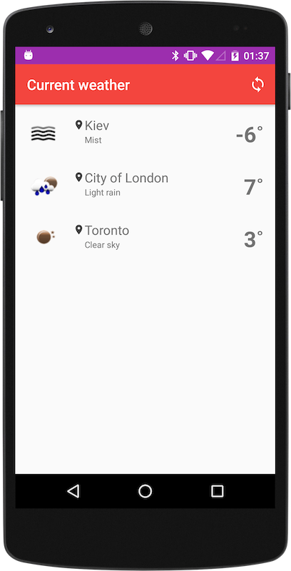

# Weather Project


PoC for [OpenWeatherMap](https://openweathermap.org) service. Gets current weather for Kyiv, London and Toronto.
Written in Kotlin using Android Architecture Components and Jetpack.

To run the project just checkout the repo, fire up your Android device and run
```bash
./gradlew installDebug
```